Software Process Models
⦁	Generic process framework
 ⦁	Communication
 ⦁	Planning
 ⦁	Modelling (analyze, design)
 ⦁	Construction (code, testing)
 ⦁	Deployment
⦁	Waterfall model
 ⦁ Oldest
 ⦁ When 100% requirements are accurate
 ⦁ Linear
 - Cons
 - Iteration is not possible, any change causes confusion
 - Quality is impacted hard whenever it is noticed that one of the phases went kaput
 - It is required that you still continue and deliver the product
 - Customer wont always state all the requirements up front, change is inevitable
 - Working version is not ready until the final phase
  - Overall it provides very low accommodation to changes
⦁	Waterfall model with feedback loop
	⦁	Flexible
	⦁	Risk mitigation
	⦁	Time-taking, Complex
⦁	Incremental Model
	⦁	When requirements are well understood
	⦁	Multiple independent deliveries
	⦁	Workflow is linear in increment but staggered between increments
⦁	Iterative
	⦁	Less workforce required
	⦁	Costly, non-satisfactory usually for customers
⦁	 Prototyping Model
	⦁	Creates a model of product before final product
	⦁	Iterative
	⦁	When requirements are not that well understood
	⦁	Focuses on visibility of product
	⦁	Time taking, customer accepts “demo”, developers get lazy thus implementation compromises so discard model after getting it approved.
⦁	Spiral Model
	⦁	When risks are high and requirements are not well understood
	⦁	Evolutionary approach (incremental + iterative)
	⦁	Inner spiral = taking requirements. Outer spiral = waterfall approach but allow changes
	⦁	Requires expertise, uncertain iterations (too much= chaos, too less= very slow)
	⦁	A decision is made after every complete spiral
	⦁	 Should focus on flexibility and extensibility > high quality. Speed > zero defects

---

Intro to Agile Development
⦁	Agility
	⦁	Rapid response to change
	⦁	Customer involvement in team
	⦁	Organization team to control work
	⦁	Incremental delivery of product
⦁	Agile process
	⦁	User stories/scenarios
	⦁	Plans are short-lived
	⦁	Iterative
	⦁	Adapts to change
	⦁	Incremental product
	⦁	People, not process
	⦁	Simplicity
⦁	Agile Process models
	⦁	XP programming
	⦁	Scrum

---

XP Programming
⦁	Best used
	⦁	Extreme approach – iterative
	⦁	Increments delivered every 2 weeks
⦁	Steps involved
	⦁	Planning= user stories, values, acceptance test criteria, iteration plan, deadline, costs
	⦁	Design= CRC cards, spike solutions(prototypes), follows KIS principal
	⦁	Coding= pair programming, unit testing, refactoring (change code to reduce complexity, shouldn’t change functionality, automated test cases used to check running code)
	⦁	Testing = unit tests, acceptance test criteria, automated test cases
	⦁	= Software increment
⦁	Customer role
	⦁	User stories (cards -> implementation task)
	⦁	Prioritize features
	⦁	Acceptance test
⦁	Problems
	⦁	Customer involvement (not always representative)
	⦁	Architectural design (costly)
	⦁	Test complacency (more positive tests != good program)

 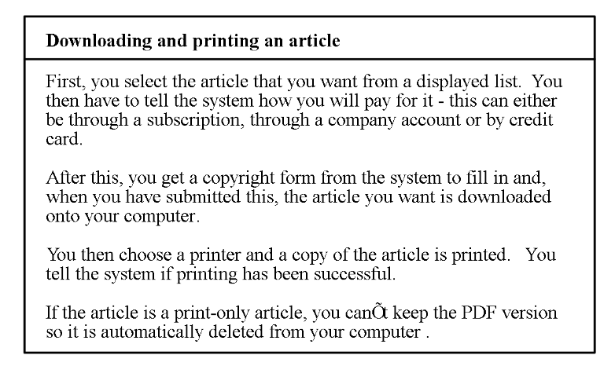
 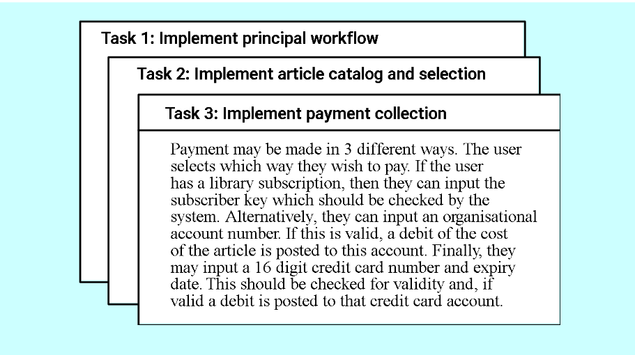
 
Scrum
⦁	Consists of
⦁	Backlog
⦁	Scrum meetings
ii. Plan meeting (Product owner -> team // priorities are discussed)
iii. Review meeting (4 hours, team->Product owner // shows results, informal)
iv. Daily scrum (15 minutes, Scrum master and team)
v. Sprint Retrospective (Product owner, scrum master, team) , meeting to review last sprint, lasts 3 hours
⦁	Sprints
⦁	Scrum roles
⦁	Product owner
⦁	Scrum master
⦁	Team
⦁	Artefacts
⦁	Product backlog
⦁	Sprint backlog
⦁	Sprint burndown chart
⦁	Product increment (product of every increment, functional, can be sold on its own)
⦁	XP vs Scrum
⦁	XP = more technical, scrum= focuses on framework
⦁	XP= small team, scrum = larger team
⦁	Scrum = has roles, XP= no roles

 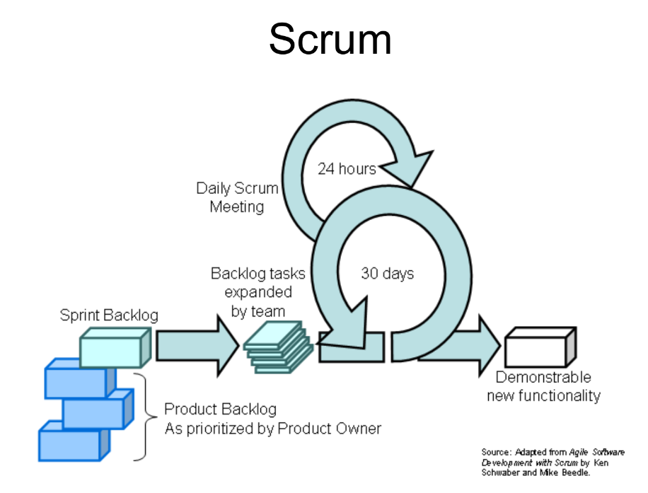
 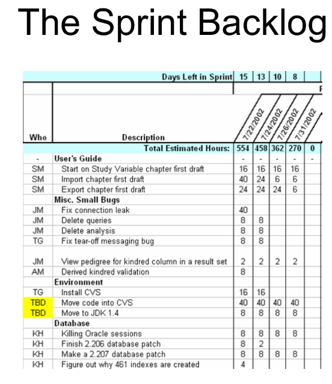
 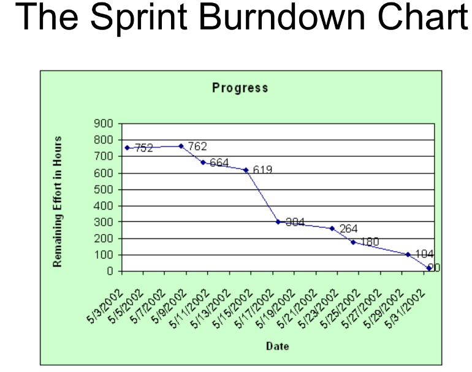

---

Requirement Engineering
⦁	Why?
⦁	No understanding
⦁	Disorganized
⦁	Not much verification
⦁	No solid base of software
⦁	Developers mindset = clear as we go, will examine increments, start coding asap
⦁	Steps
⦁	Inception
⦁	Elicitation
⦁	Elaboration
⦁	Negotiation
⦁	Specification
⦁	Validation
⦁	Requirements Management

⦁	Inception
⦁	Requirement Engineer asks questions to understand clearly (customer, stakeholder, benefits) // problem and solution, effectiveness of communication
⦁	Elicitation
⦁	To extract information
⦁	Has problems (scope, understanding, volatility)
⦁	Collaborative requirement gathering
ii. Meeting = customer, engineers, stakeholder
iii. Control = facilitator = customer/developer/anyone from outside
iv. Definition mechanism = tools used
V. goal = identify problems, get different approaches, requirements

⦁	Quality function deployment (QFD)
ii. Customer needs -> technical document
iii. Normal requirements = normal goals
iv. Expected requirements = not explicitly mentioned
v. Exciting requirements = extra features without extra pay
vi. R/s matrix
vii. Benefits = avoid loss of information, improves user and team involvement, saves time of cycle, better quality product
  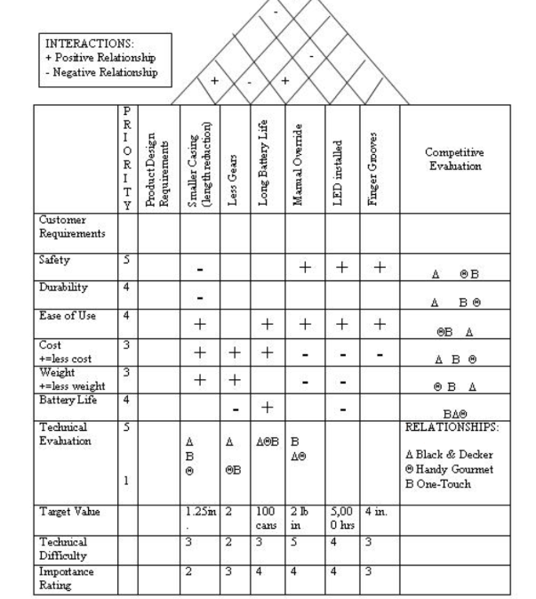
⦁	Elaboration
⦁	Analysis modelling
⦁	First technical diagram
⦁	Essential vs implementation tasks
⦁	Visible requirements
⦁	Structured analysis = Data -> attributes and relations, input // transformation // output. Consists of flow oriented modelling (flow chart showing input, processes and output)
⦁	Object oriented = classes and their collaborations. Consists of scenario (use user stories), class based (divide work to classes) and behavioral modelling (states of processes)
⦁	Scenario = use cases (find actors first), activity diagram, swim lane diagram

 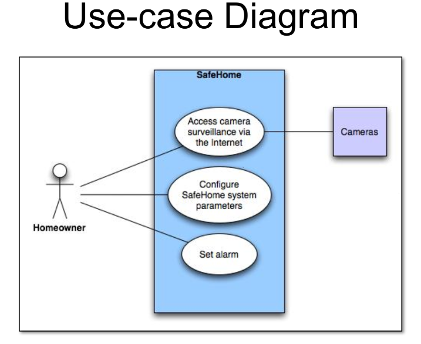
 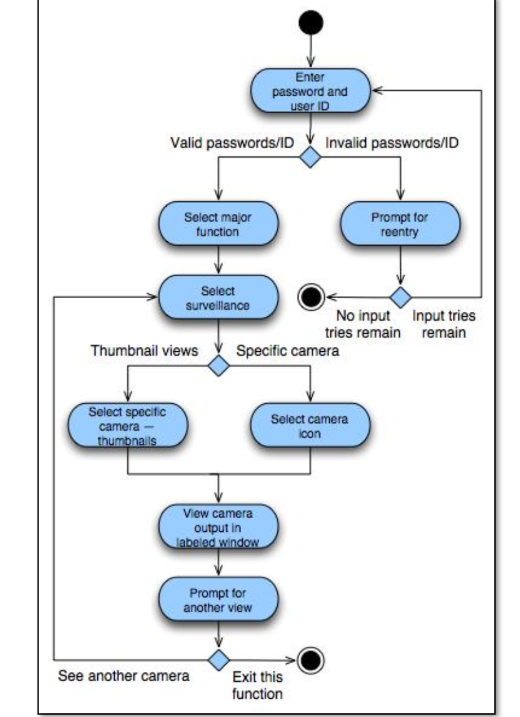

 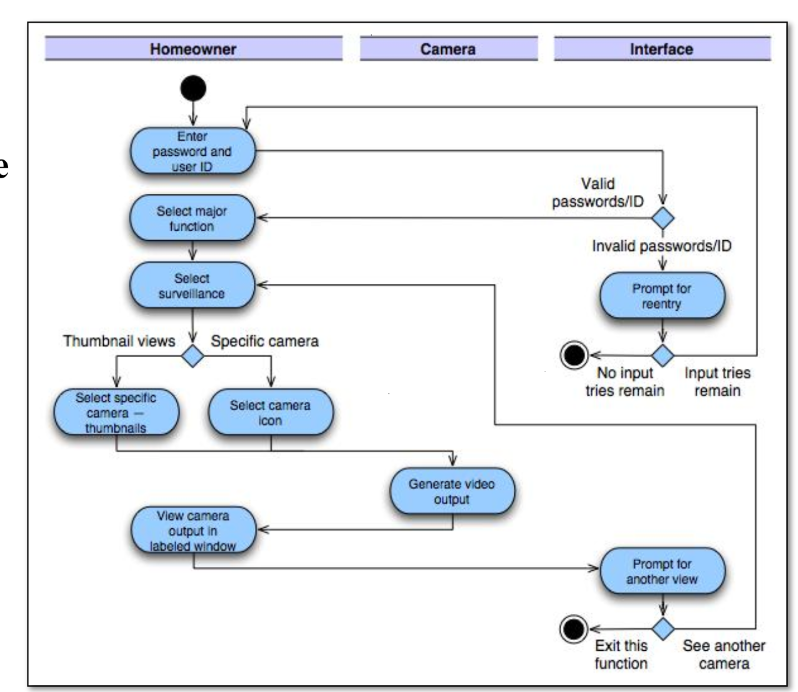
⦁	Class based= extract nouns (class attributes) and verbs (operations) from a paragraph, CRC
  
  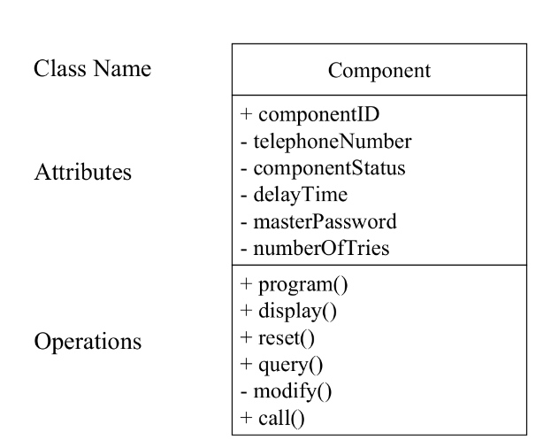
 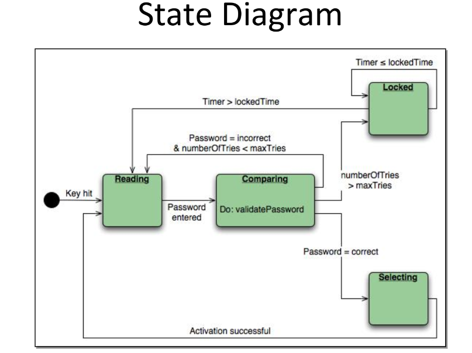
 
Flow based = DFD, CFD
Behavior model = State diagram, sequence diagram

⦁	Negotiation
⦁	Wants vs can be done
⦁	Requirements are ranked
⦁	Risk analysis
⦁	Costs and deadline
⦁	Iterative, requirements can be cut/modified to reach common ground, try to satisfy customers
⦁	Specification
⦁	Final work product (SRS Document)
⦁	Foundation
⦁	Functions, behavior, constraints, information
⦁	All kind of requirements, tests, linkage of requirements = crux of everything
⦁	Validation
⦁	SRS quality assessment
⦁	To check if everything is met and mentioned = confliction, clear information, test analysis
⦁	Primary requirement validation mechanism
⦁	Engineers, customers, users, stakeholders involved
⦁	Requirement management task
⦁	Each requirement has identifier
⦁	More focus on requirement traceability tables = RTM (Requirement Traceability Matrix)
⦁	Requirement dependence
⦁	Linkage between requirements, test cases, diagrams used

Diagrams
Use cases
  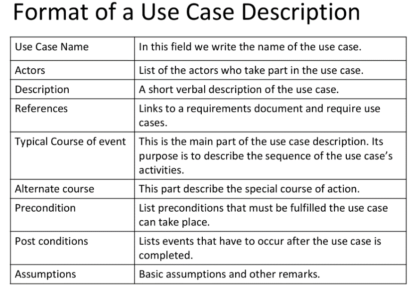
  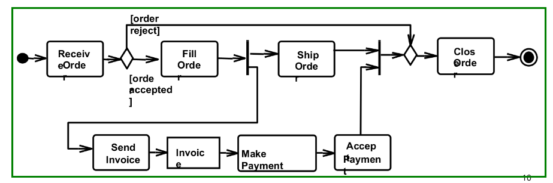

Activity diagram
⦁	Analyze use cases
⦁	Can add parallel activities (differs from flowchart)
⦁	Multi-threaded
⦁	Doesn’t show object collaboration or behavior over a lifetime
⦁	Can be used to define event in a use case
⦁	Workflow
⦁	Special case of state chart diagram
⦁	Control flow edge?
⦁	Object flow edge?
⦁	Initial node = dot
⦁	Decision node = diamond
⦁	Merge nodes= 3->1
⦁	Fork nodes= 1->3 /// ?? control nodes
⦁	Final nodes
⦁	flow final (circle w inside as X) incase of all tokens
⦁	final node = dot in a circle, incase of 1 token
⦁	Object nodes
⦁	Activity, w/pins
⦁	central buffer (multiple inputs and output)
⦁	data store = holds data persistently like a databse

Activity diagram
