**[Software Process Models]{.underline}**

  

1.  Generic process framework

  

```{=html}

<!-- -->

```

a.  Communication

  

b.  Planning

  

c.  Modelling (analyze, design)

  

d.  Construction (code, testing)

  

e.  Deployment

  

```{=html}

<!-- -->

```

2.  Waterfall model

  

```{=html}

<!-- -->

```

a.  Oldest

  

b.  When 100% requirements are accurate

  

c.  Linear

  

d.  No iteration, Final product is the only product produced

  

```{=html}

<!-- -->

```

3.  Waterfall model with feedback loop

  

```{=html}

<!-- -->

```

a.  Flexible

  

b.  Risk mitigation

  

c.  Time-taking, Complex

  

```{=html}

<!-- -->

```

4.  Incremental Model

  

```{=html}

<!-- -->

```

a.  When requirements are well understood

  

b.  Multiple independent deliveries

  

c.  Workflow is linear in increment but staggered between increments

  

d.  Iterative

  

e.  Less workforce required

  

f.  Costly, non-satisfactory usually for customers

  

```{=html}

<!-- -->

```

5.  Prototyping Model

  

```{=html}

<!-- -->

```

a.  Creates a model of product before final product

  

b.  Iterative

  

c.  When requirements are not that well understood

  

d.  Focuses on visibility of product

  

e.  Time taking, customer accepts "demo", developers get lazy thus

    implementation compromises so discard model after getting it

    approved.

  

```{=html}

<!-- -->

```

6.  Spiral Model

  

```{=html}

<!-- -->

```

a.  When risks are high and requirements are not well understood

  

b.  Evolutionary approach (incremental + iterative)

  

c.  Inner spiral = taking requirements. Outer spiral = waterfall

    approach but allow changes

  

d.  Requires expertise, uncertain iterations (too much= chaos, too less=

    very slow)

  

e.  A decision is made after every complete spiral

  

```{=html}

<!-- -->

```

7.  Should focus on flexibility and extensibility \> high quality. Speed

    \> zero defects

  

**[Intro to Agile Development]{.underline}**

  

1.  Agility

  

```{=html}

<!-- -->

```

a.  Rapid response to change

  

b.  Customer involvement in team

  

c.  Organization team to control work

  

d.  Incremental delivery of product

  

```{=html}

<!-- -->

```

2.  Agile process

  

```{=html}

<!-- -->

```

a.  User stories/scenarios

  

b.  Plans are short-lived

  

c.  Iterative

  

d.  Adapts to change

  

e.  Incremental product

  

f.  People, not process

  

g.  Simplicity

  

```{=html}

<!-- -->

```

3.  Agile Process models

  

```{=html}

<!-- -->

```

a.  XP programming

  

b.  Scrum

  

**[XP Programming]{.underline}**

  

1.  XP Programming

  

```{=html}

<!-- -->

```

a.  Best used

  

b.  Extreme approach -- iterative

  

c.  Increments delivered every 2 weeks

  

```{=html}

<!-- -->

```

2.  Steps involved

  

```{=html}

<!-- -->

```

a.  Planning= user stories, values, acceptance test criteria, iteration

    plan, deadline, costs

  

b.  Design= CRC cards, spike solutions(prototypes), follows KIS

    principal

  

c.  Coding= pair programming, unit testing, refactoring (change code to

    reduce complexity, shouldn't change functionality, automated test

    cases used to check running code)

  

d.  Testing = unit tests, acceptance test criteria, automated test cases

  

e.  = Software increment

  

```{=html}

<!-- -->

```

3.  Customer role

  

```{=html}

<!-- -->

```

a.  User stories (cards -\> implementation task)

  

b.  Prioritize features

  

c.  Acceptance test

  

```{=html}

<!-- -->

```

4.  Problems

  

```{=html}

<!-- -->

```

a.  Customer involvement (not always representative)

  

b.  Architectural design (costly)

  

c.  Test complacency (more positive tests != good program)

  

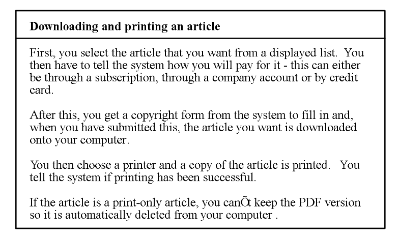{width="6.5in"

height="3.873611111111111in"}

  

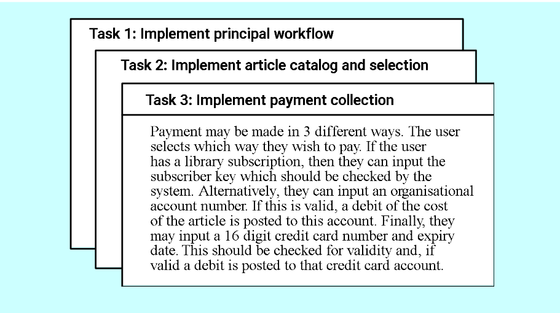{width="6.5in"

height="3.638888888888889in"}

  

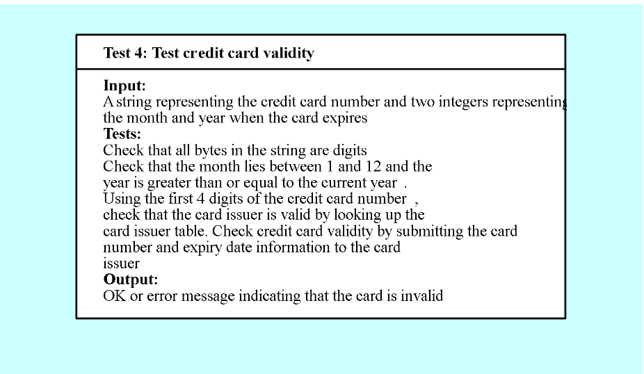{width="6.5in"

height="3.776388888888889in"}

  

**[Scrum]{.underline}**

  

1.  Consists of

  

```{=html}

<!-- -->

```

a.  Backlog

  

b.  Scrum meetings

  

> ii\. Plan meeting (Product owner -\> team // priorities are discussed)

>

> iii\. Review meeting (4 hours, team-\>Product owner // shows results,

> informal)

>

> iv\. Daily scrum (15 minutes, Scrum master and team)

>

> v\. Sprint Retrospective (Product owner, scrum master, team) , meeting

> to review last sprint, lasts 3 hours

  

c.  Sprints

  

```{=html}

<!-- -->

```

2.  Scrum roles

  

```{=html}

<!-- -->

```

a.  Product owner

  

b.  Scrum master

  

c.  Team

  

```{=html}

<!-- -->

```

3.  Artefacts

  

```{=html}

<!-- -->

```

a.  Product backlog

  

b.  Sprint backlog

  

c.  Sprint burndown chart

  

d.  Product increment (product of every increment, functional, can be

    sold on its own)

  

```{=html}

<!-- -->

```

4.  XP vs Scrum

  

```{=html}

<!-- -->

```

a.  XP = more technical, scrum= focuses on framework

  

b.  XP= small team, scrum = larger team

  

c.  Scrum = has roles, XP= no roles

  

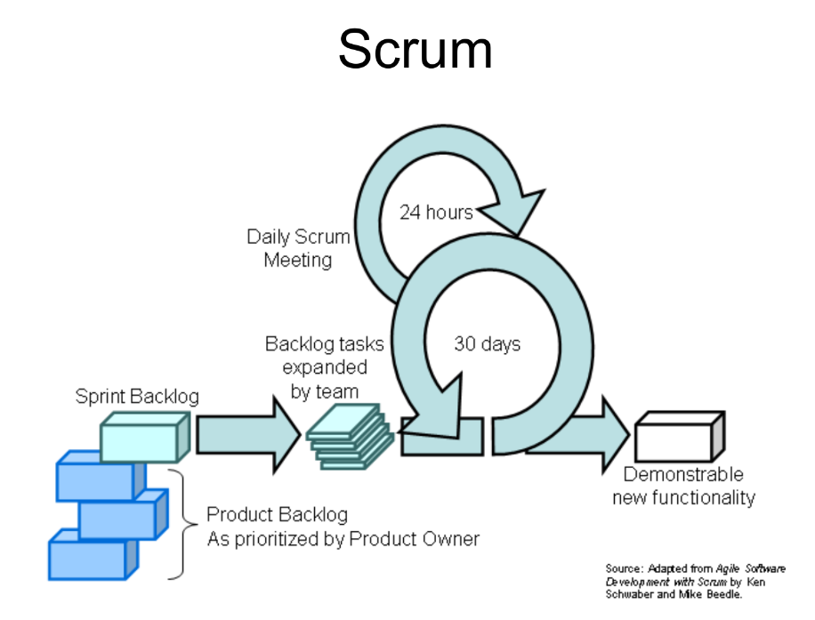{width="5.011626202974628in"

height="3.8133333333333335in"}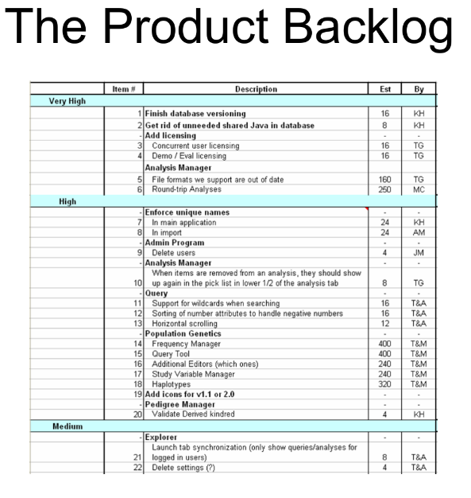{width="4.616433727034121in"

height="4.873333333333333in"}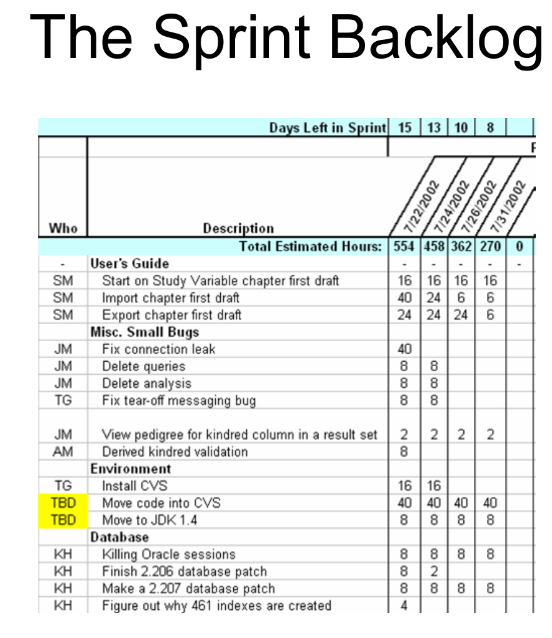{width="4.3in"

height="4.96992782152231in"}

  

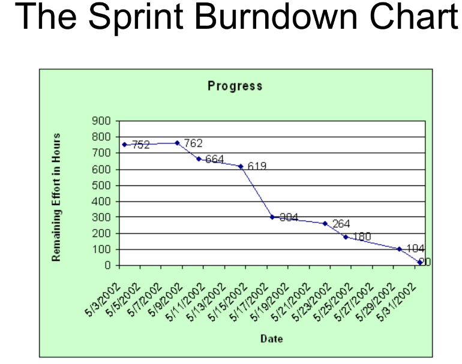{width="4.4398654855643045in"

height="3.5in"}

  

**Requirement Engineering**

  

A.  Why?

  

```{=html}

<!-- -->

```

a.  No understanding

  

b.  Disorganized

  

c.  Not much verification

  

d.  No solid base of software

  

e.  Developers mindset = clear as we go, will examine increments, start

    coding asap

  

```{=html}

<!-- -->

```

B.  Steps

  

```{=html}

<!-- -->

```

a.  Inception

  

b.  Elicitation

  

c.  Elaboration

  

d.  Negotiation

  

e.  Specification

  

f.  Validation

  

g.  Requirements Management

  

```{=html}

<!-- -->

```

1.  Inception

  

```{=html}

<!-- -->

```

a.  Requirement Engineer asks questions to understand clearly (customer,

    stakeholder, benefits) // problem and solution, effectiveness of

    communication

  

```{=html}

<!-- -->

```

2.  Elicitation

  

```{=html}

<!-- -->

```

a.  To extract information

  

b.  Has problems (scope, understanding, volatility)

  

c.  Collaborative requirement gathering

  

> ii\. Meeting = customer, engineers, stakeholder

>

> iii\. Control = facilitator = customer/developer/anyone from outside

>

> iv\. Definition mechanism = tools used

>

> V. goal = identify problems, get different approaches, requirements

  

d.  Quality function deployment (QFD)

  

> ii\. Customer needs -\> technical document

>

> iii\. Normal requirements = normal goals

>

> iv\. Expected requirements = not explicitly mentioned

>

> v\. Exciting requirements = extra features without extra pay

>

> vi\. R/s matrix

>

> vii\. Benefits = avoid loss of information, improves user and team

> involvement, saves time of cycle, better quality product

  

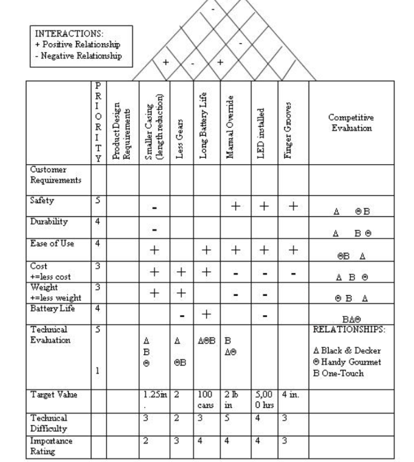{width="5.025435258092738in"

height="5.6088188976377955in"}

  

3.  Elaboration

  

```{=html}

<!-- -->

```

a.  Analysis modelling

  

b.  First technical diagram

  

c.  Essential vs implementation tasks

  

d.  Visible requirements

  

e.  Structured analysis = Data -\> attributes and relations, input //

    transformation // output. Consists of flow oriented modelling (flow

    chart showing input, processes and output)

  

f.  Object oriented = classes and their collaborations. Consists of

    scenario (use user stories), class based (divide work to classes)

    and behavioral modelling (states of processes)

  

g.  Scenario = use cases (find actors first), activity diagram, swim

    lane diagram

  

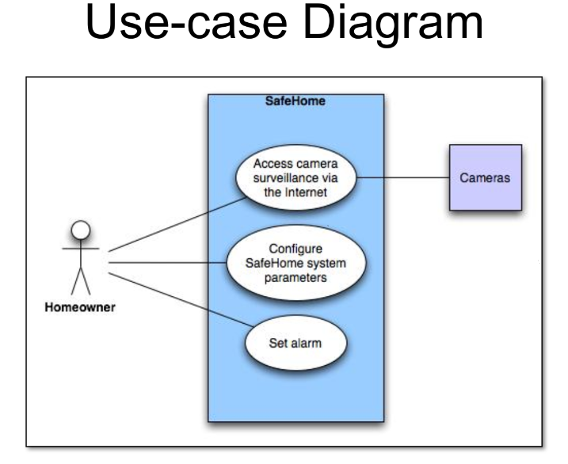{width="3.4096237970253718in"

height="2.7866666666666666in"}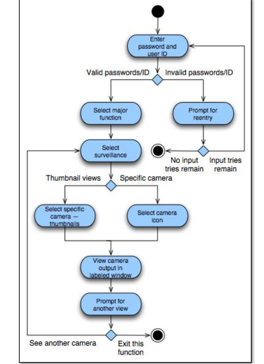{width="3.7035793963254595in"

height="5.1066666666666665in"}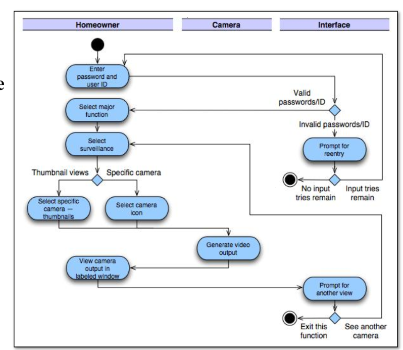{width="3.32in"

height="2.8791076115485565in"}

  

h.  Class based= extract nouns (class attributes) and verbs (operations)

    from a paragraph, CRC

  

> 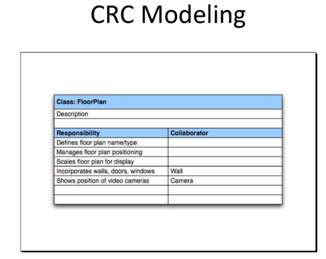{width="2.92in"

> height="2.313507217847769in"}

>

> 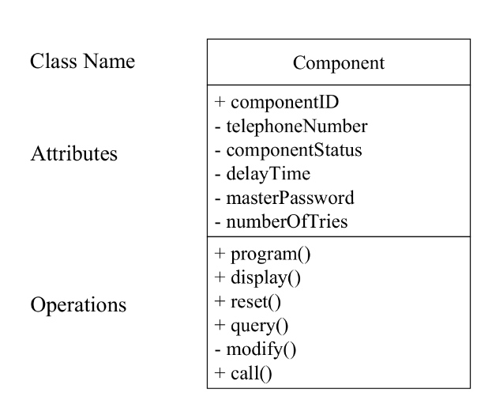{width="3.1533333333333333in"

> height="2.5611351706036745in"}

  

Flow based = DFD, CFD

  

Behavior model = State diagram, sequence diagram

  

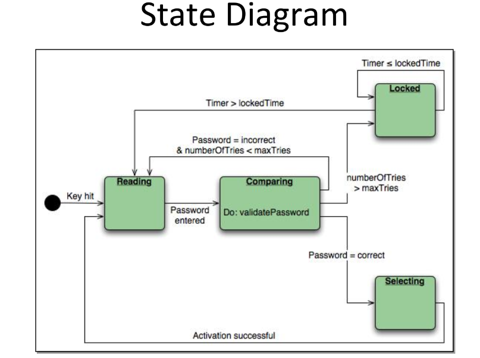{width="4.046666666666667in"

height="3.0237587489063866in"}

  

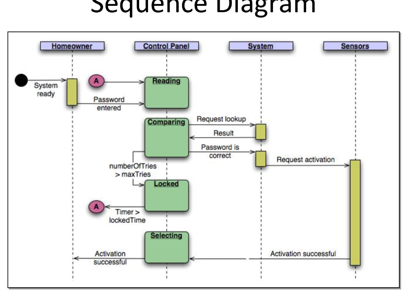{width="4.4885356517935255in"

height="3.2in"}

  

4.  Negotiation

  

```{=html}

<!-- -->

```

a.  Wants vs can be done

  

b.  Requirements are ranked

  

c.  Risk analysis

  

d.  Costs and deadline

  

e.  Iterative, requirements can be cut/modified to reach common ground,

    try to satisfy customers

  

```{=html}

<!-- -->

```

5.  Specification

  

```{=html}

<!-- -->

```

a.  Final work product (SRS Document)

  

b.  Foundation

  

c.  Functions, behavior, constraints, information

  

d.  All kind of requirements, tests, linkage of requirements = crux of

    everything

  

```{=html}

<!-- -->

```

6.  Validation

  

```{=html}

<!-- -->

```

a.  SRS quality assessment

  

b.  To check if everything is met and mentioned = confliction, clear

    information, test analysis

  

c.  Primary requirement validation mechanism

  

d.  Engineers, customers, users, stakeholders involved

  

```{=html}

<!-- -->

```

7.  Requirement management task

  

```{=html}

<!-- -->

```

a.  Each requirement has identifier

  

b.  More focus on requirement traceability tables = RTM (Requirement

    Traceability Matrix)

  

c.  Requirement dependence

  

d.  Linkage between requirements, test cases, diagrams used

  

**Diagrams**

  

**[Use cases]{.underline}**

  

> 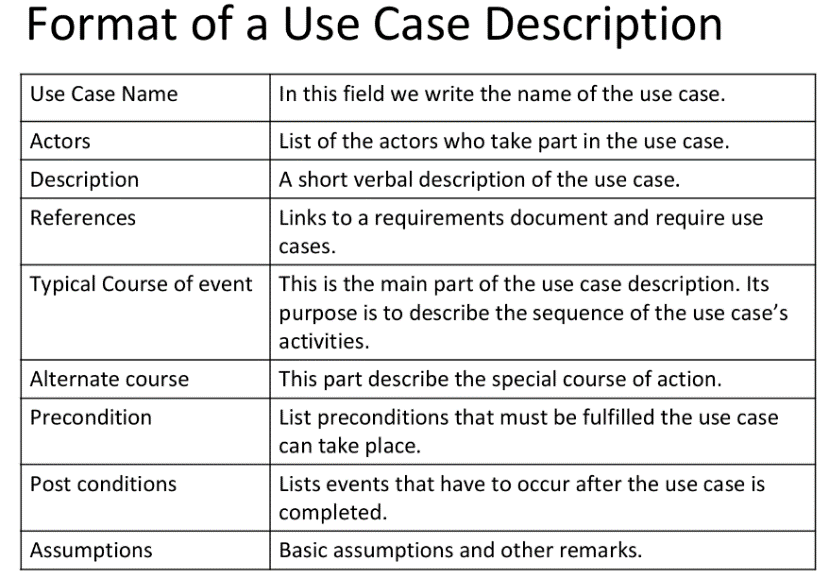{width="3.7684853455818024in"

> height="2.6266666666666665in"}

  

**[Activity diagram]{.underline}**

  

1.  Analyze use cases

  

2.  Can add parallel activities (differs from flowchart)

  

3.  Multi-threaded

  

4.  Doesn't show object collaboration or behavior over a lifetime

  

5.  Can be used to define event in a use case

  

6.  Workflow

  

7.  Special case of state chart diagram

  

8.  Control flow edge?

  

9.  Object flow edge?

  

10. Initial node = dot

  

11. Decision node = diamond

  

12. Merge nodes= 3-\>1

  

13. Fork nodes= 1-\>3 /// ?? control nodes

  

14. Final nodes

  

```{=html}

<!-- -->

```

a.  flow final (circle w inside as X) incase of all tokens

  

b.  final node = dot in a circle, incase of 1 token

  

```{=html}

<!-- -->

```

15. Object nodes

  

```{=html}

<!-- -->

```

a.  Activity, w/pins

  

b.  central buffer (multiple inputs and output)

  

c.  data store = holds data persistently like a databse

  

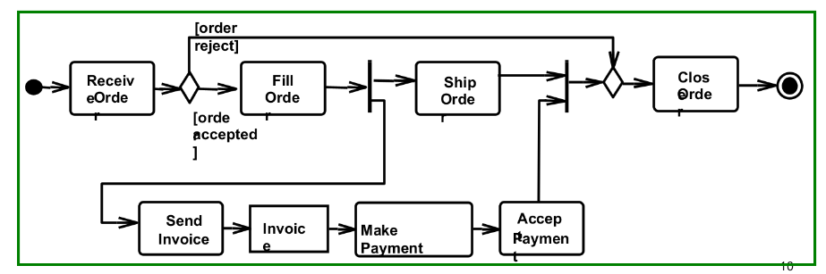{width="6.5in"

height="2.1618055555555555in"}

  

**[Activity diagram]{.underline}**